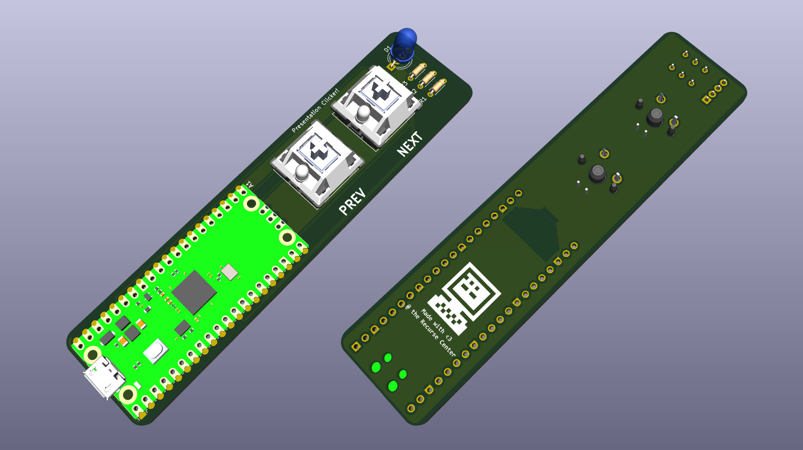

# USB Presentation Clicker - PCB and firmware

## The Recurse Center - 15 Minute Non-Programming Talk

This project was created as a 15 minute intro to circuit board concepts and design, including a live demonstration of the process of schematic capture and PCB design for this simple presentation clicker.

[The slides for the talk leading up to the demo are available here.](https://docs.google.com/presentation/d/1ne3fzInx9VCI7aZ8SwKrGWYj8iwI68Q8ZW5xORLohZw)

<a href='https://www.recurse.com/scout/click?t=0059f2068e4524d430ccfedb6323af8e
' title='Made with love at the Recurse Center'></a>

## Printed Circuit Board

The schematic and board design are made with KiCAD 9.0, available from [kicad.org](https://www.kicad.org/). The project file is at [`rc-demo.kicad_pro`](./rc-demo.kicad_pro).



The schematic and board layours were done live in front of an audience in around 10 minutes, so there's lots of room for improvement or expansion. Try tweaking the design to fit your sensibilities, or deleting the current design and starting fresh!

To learn more about KiCAD, check out their [getting started guide](https://docs.kicad.org/9.0/en/getting_started_in_kicad/getting_started_in_kicad.html#basic_concepts_and_workflow).

## Firmware

The firmware for the remote is written in Rust, using the `rp_pico` board support package and `embedded-hal` traits, and using the [`usbd_human_interface_device`](https://crates.io/crates/usbd-human-interface-device) crate to implement the USB HID protocol for a keyboard. The firmware entrypoint is at [`src/main.rs`](./src/main.rs).

If you've installed the rust toolchain with `rustup`, the appropriate extras will be installed automatically as defined in the [`rust-toolchain.toml`](./rust-toolchain.toml) file. The only additional requirement is to install one (or both) of the following tools for flashing the firmware to the RP2040:

```shell
# Install probe-rs for flashing and debugging with debugging probe (requires cargo-binstall)
cargo binstall probe-rs-tools
# Install elf2uf2-rs to flash via RP2040 USB bootloader
cargo install elf2uf2-rs
```

By default, `cargo run` will use probe-rs to load and debug the firmware:

```shell
cargo run
```

To flash the firmware via the RP2040 USB bootloader, you can use:

```shell
cargo build
elf2uf2-rs ./target/thumbv6m-none-eabi/debug/usb-presentation-remote
```

And then copy the `./target/thumbv6m-none-eabi/debug/usb-presentation-remote.uf2` to the `RPI-RP2` drive that appears when you hold the BOOTSEL button on the RP2040 board while plugging it into your computer.
